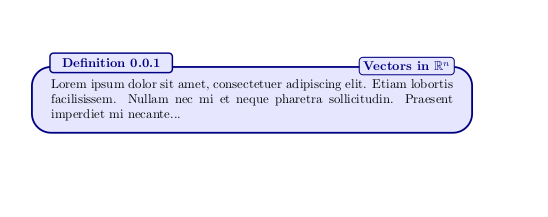
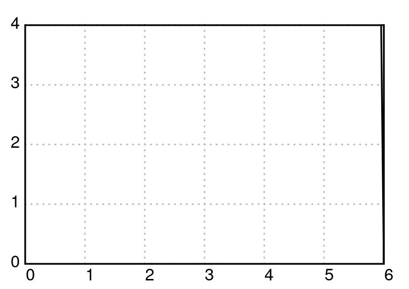

[![MIT License][license-shield]][license-url]
[![LinkedIn][linkedin-shield]][linkedin-url]


# About the Project
This repository will contain my LaTeX templates, lecture notes, etc. for the MA Mathematics program 
that I will be taking at the University of the Philippines Diliman.


## Lecture Notes Template

The only thing special with this template is that it lets you write elegant Definitions, Theorems, etc. using the `itaewon` package.

#### Sample Usage

```tex
\documentclass{article}
\usepackage{itaewon}
\usepackage{amsfonts}

\begin{document}

    \begin{DefinitionBox}[]{Definition}{Vectors in $\mathbb{R}^n$}
        
        Lorem ipsum dolor sit amet, consectetuer adipiscing elit.  
        Etiam lobortis facilisissem.  Nullam nec mi et neque pharetra 
        
        sollicitudin.  Praesent imperdiet mi necante...
    \end{DefinitionBox}

\end{document}


```

<details>
<summary><b>See Sample Content</b></summary>

#### Sample Output



### 30-60-90 Right Triangle by Paper Folding



### Code to generate 30-60-90 Right Triangle by Paper Folding

<b>NOTE:</b> XeLaTeX is needed to render the code below.

```tex
\documentclass[pstricks,border=12pt]{standalone}
\usepackage{pst-eucl,multido,fp}

\FPset\Width{6.00}
\FPset\Height{4.00}


\psset
{
    PointName=none,
    PointSymbol=none,
}

\def\Picture#1#2{%
\def\X{#1}\def\Y{#2}
\begin{pspicture}[showgrid=tru](\Width,\Height)
        \pstGeonode(0,0){BottomLeft}(\Width,\Height){TopRight}(\X,\Height){Top}(\Width,\Y){Right}
        \pstOrtSym{Top}{Right}{TopRight}
        \pspolygon[dimen=inner](BottomLeft)(BottomLeft|Top)(Top)(Right)(TopRight|BottomLeft)    
        \pspolygon[fillstyle=solid,linestyle=none](Top)(TopRight)(Right)
        \pspolygon[fillstyle=solid,linejoin=1](Top)(TopRight')(Right)
\end{pspicture}%
}
\begin{document}
\multido{\nx=\Width+-0.1}{24}{\Picture{\nx}{0}}
\FPeval\Start{round(Width+14*(-0.25):2)}%
\end{document}


```

</details>


[license-shield]: https://img.shields.io/github/license/othneildrew/Best-README-Template.svg?style=for-the-badge
[license-url]: https://github.com/benjcabalona1029/MAMathematics2021/blob/main/LICENSE
[linkedin-shield]: https://img.shields.io/badge/-LinkedIn-black.svg?style=for-the-badge&logo=linkedin&colorB=555
[linkedin-url]: https://www.linkedin.com/in/benjcabalonajr
